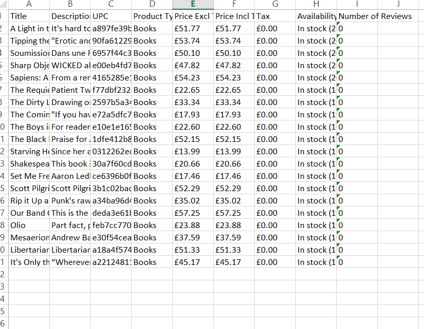

# Book Scraper — Playwright + OpenPyXL

A Python web scraper that extracts detailed product data for every book listed on [books.toscrape.com](https://books.toscrape.com) and saves it to a clean Excel spreadsheet.

## What it does

- Visits the site's book listing page and collects the title and link for every book
- Navigates into each book's individual product page
- Extracts: **Title, Description, UPC, Product Type, Price (excl. tax), Price (incl. tax), Tax, Availability, Number of Reviews**
- Saves all results into a single `.xlsx` file, with a clean header row
- Handles errors gracefully — if one book's page fails to load, the script logs it and continues instead of crashing

## Tech stack

- [Playwright](https://playwright.dev/python/) — browser automation
- [OpenPyXL](https://openpyxl.readthedocs.io/) — Excel file generation

## How to run it

1. Clone this repo
2. Install dependencies:
3.  Run the script:
4.  The output file (`books_full_data.xlsx`) will be saved to your Desktop.

## Sample Output

## Notes

This project was built as a practice/demo scraper against a site designed for scraping practice. The same approach — collecting links, visiting each detail page, extracting structured data, exporting to Excel — applies directly to real-world use cases like competitor price monitoring, product catalog extraction, or directory scraping.
